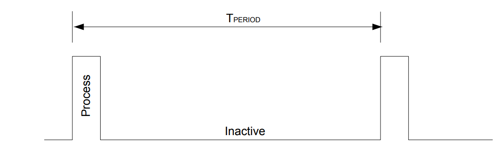

In applications where the battery lifetime is a concern, the system must be optimized to provide maximumperformance and reactivity at the minimal power consumption.
This type of application contains generally two different phases:
*  **Process phase** , in which some sensor or radio information needs to be processed at either regular time
intervals (RTC) or on external events (GPIO, interrupts..).
* **Inactive phase**, in which the system is sleeping and waiting for either RTC or GPIO wakeup.

# Key parameters to consider
Both phases have different performance criteria (in addition to power consumption):
* Process phase requires a certain number of instructions to be executed in a given time frame.
* Inactive phase requires a certain minimal context to be kept (data RAM retention) and wakeup capability (peripheral, GPIO, RTC...) while keeping the power consumption as low as possible.
Furthermore, the transition between both phases must support different constraints:
* **Sleep-to-Run** transition requires a fast wakeup time with the smallest peak current (also called inrush current) at the time of transition, in order to allow the external supply to settle.
* **Run-to-Sleep** transition has less timing concerns, but needs to be optimized for energy saving. When operating in such burst mode, four parameters need to be considered:
* Average power consumption. This parameter (Pavg expressed in µW) determines the battery size in order to support the expected autonomy.
* Maximum peak current. This parameter (Ipeak expressed in µA) determines the type of battery that can be used but also the number and size of external components (decoupling capacitors) that need to be added on
the board.
* Processing performance in Process phase. This parameter is expressed in DMIPS which is proportional to the CPU frequency (Freq).
* Reaction time. This is the time between the activation of the wakeup signal source and the execution of the first instruction, generally within the interrupt service routine (ISR), once the context has been restored
(power, data space context, clock).

## Low Power Modes 
Depending on type of controller architecture, it can support different types of Low Power Mode. For example :
* The "STM32L0" devices implement five low power modes:
>  ` Low-power run mode, Sleep mode, Low-power sleep mode, Stop mode, and Standby mode. `

The differences between these modes can be described in terms of power consumption, performance, wake-up time, and wake-up sources. If for each of these parameters, the modes are put in order from best (1) to worst (5), 
it becomes clear what the trade-offs are. Generally speaking, as power consumption goes down; the performance decreases, the wake-up time increases, and the number of wake-up sources decreases.

|   -- | LPRun | Sleep | LPSleep | Stop | Standby |
| ------ | ------- | ------ | ------- | ------ | ------- |
| Performance | 1 | 2 | 3 | 4 | 5 |
| Wake-up Sources | 1 | 2 | 3 | 4 | 5 |
| Wake-up time | 2 | 1 | 4 | 3 | 5 |
| Power-Consumption | 4 | 5 | 3 | 2 | 1 |
 

` Below Regesters are discussed in contex with STM32L0 devices `

### Low-Power Run Mode

Unlike the other low-power modes, the CPU is not stopped in Low-power run mode.
This means it is not entered via the WFI/WFE instructio, but rather by setting the LPSDSR (Low-Power Sleep-Deep/Sleep/low-power Run) and LPRUN (Low-Power RUN) bits in the PWR_CR register.
Note that LPSDSR must be set before setting LPRUN, LPRUN must be cleared before clearing LPSDSR, and LPRUN should be cleared before entering any other low-power mode.
Since program execution continues in Low-power run mode, the device is "woken" by software rather than being limited to a finite set of interrupts or events.
Simply clearing the LPRUN bit and bringing the system frequency back up to full speed will get the system back into Run mode. 

### Sleep Mode
The most straight forward of the low-power modes, Sleep mode offers the shortest wake-up time at the expense of using the most power.
The datasheet states that with all peripherals disabled and a system frequency of 16 MHz, about 1 mA of current will be consumed. This is much higher than the other low-power modes, which can achieve values on the order of microamps or even nanoamps.
The wake-up time, however, is almost ten times faster than the most competitive low-power mode. Table 2 shows the amount of time it takes for the device to wake up from each low-power mode and enter Run mode.

***Wake-up to Run mode times for each low-power mode***
|Low-power Mode | Wake-up Time |
|--------------|---------------|
|Low-power run	| 3 µs |
|Sleep |	0.36 µs|
|Low-power sleep |	32 µs |
|Stop	| 3.5 µs |
|Standby |	50 µs |

In Sleep mode, only the core is stopped while all peripherals continue to run. This makes it practically effortless to enter Sleep mode because the system frequency does not have to be decreased and all of the device's peripherals are available for use.
Also, it is very easy to exit Sleep mode since any interrupt or event available in Run mode can wake the device and be serviced with very low latency. Thus, Sleep mode can be used in almost any situation where the CPU is in a spinlock waiting for an event to occur.
Rather than enter a busy-wait loop, the user could simply execute WFI or WFE (depending on the wake-up method) to suspend execution and save power until the core is needed again.

### Low-Power Sleep Mode
Low-power sleep mode is essentially a combination of Low-power run mode and Sleep mode. Not only is the Cortex-M0+ core stopped, but the regulator is placed into low power mode, which means the same conditions as those from Low-power run mode must be met.
The reference manual mentions the option of switching off the Flash memory in the Low-power sleep mode section. Setting the SLEEP_PD (SLEEP Power-Down) bit in the FLASH_ACR register will place the non-volatile memory in power-down mode when the device enters either Sleep mode or Low-power sleep mode.
While this does increase the wake-up latency, the power consumption is reduced by about 12 µA, which may be significant depending on the application. 
The increased wake-up time is presumably the reason that no mention of this option is made in the Sleep mode section of the reference manual (even though it does work in Sleep mode)

### Stop Mode
Stop mode has the potential to achieve current consumption on the order of nanoamps while still retaining the SRAM and register contents. However, if wake-up time is more critical, many of the power saving options may be ignored in order to achieve latency on par with that of Low-power run mode.
Further complicating matters are the limited number of available wake-up sources, the multiple mentions of Stop mode in the errata sheet, and the added debugging complexity.
Nevertheless, Stop mode is likely the best option for those wanting to use the least amount of power while not having to reinitialize the system upon waking.
In Stop mode, the core is stopped and the only oscillators that are able to run are the LSE, LSI, and the HSI in a limited capacity. The low-speed clocks allow the RTC and IWDG to continue running and wake-up the device. The HSI can provide limited functionality to peripherals capable of running in Stop mode.
For example, the USART and I2C are still able to receive data in Stop mode by waking up the HSI when it is needed. The HSI will only feed the peripheral that requested it and will automatically be disabled when it is no longer needed. 

### Standby Mode
The only oscillators available are the LSI and LSE, the only peripherals that can function are the RTC and IWDG, the voltage regulator is completely disabled, and all I/O pins are set as high impedance (so saving the context is pointless).
All the user has to do to enter Standby mode is set the SLEEPDEEP bit, set the PDDS bit, and be sure that the WFU bit is cleared by writing a '1' to the CWUF bit. Then, executing the WFI instruction, the WFE instruction, or setting SLEEPONEXIT before an exception return will cause the device to enter this low-power mode.
There are also fewer options for exiting Standby mode. Only a rising edge on a wake-up pin (PA0 or PC13), one of the RTC wake-up events, or a IWDG reset will wake the device. The method of choice must be configured and the corresponding wake-up flags cleared before Standby mode is entered.
Note that the STM32L053C8 chip only has two wake-up pins whereas the reference manual and datasheet will often mention a third wake-up pin only available on the packages with higher pin counts.

The biggest problem with Standby mode is that it does not preserve the contents of SRAM or the registers (except the RTC registers, RTC backup registers, and the Standby circuitry). After waking from Standby mode, the program execution restarts in the same way as if a reset had occurred.

## Conclusion

Low-power run mode yields the best performance while still consuming less current than sleep mode. Because the CPU is kept running, the decision to wake the device is made by software, providing the most flexibility in that respect. Unfortunately, having the regulator in low-power mode introduces a wake-up latency that is too great for many real-time applications.
This is where Sleep mode really excels, boasting a wake-up time of 0.36 µs as a result of allowing all peripherals to run at full speed while the core is disabled. However, this also makes it the most power hungry low-power mode, which the peripheral performance and full set of hardware wake-up sources do little to compensate for.
Low-power sleep mode uses the same approach as Low-power run mode to reduce the current consumption to levels comparable to Stop mode without limiting the number of wake-up sources. If it is sufficient to have the EXIT wake the device, however, Stop mode provides the lowest current consumption while still preserving the SRAM and register contents.
It also has a wake-up time comparable to Low-power run mode.
Finally, for applications where the MCU is not needed for very long periods of time, Standby mode may be appropriate. It uses the least amount of power at the expense of having very few wake-up sources and the longest wake-up time.
